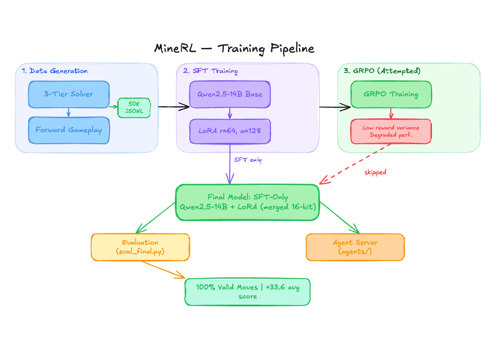
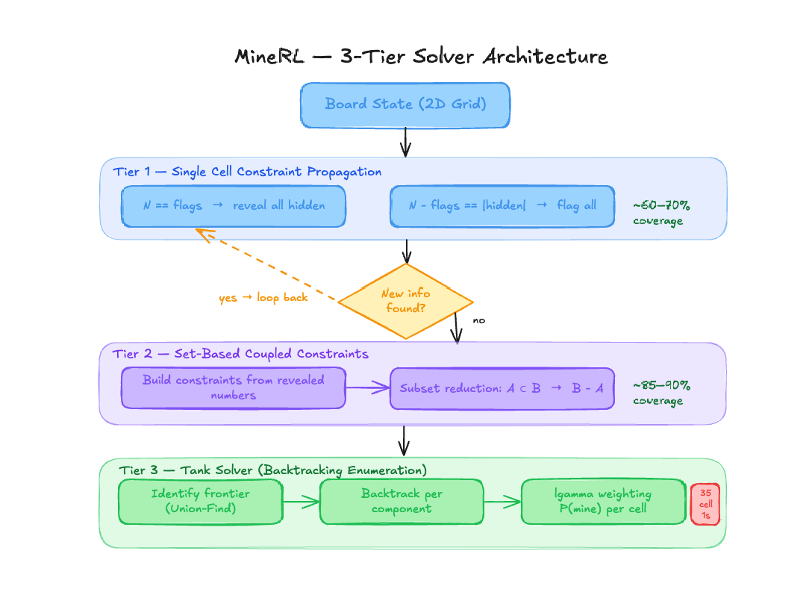
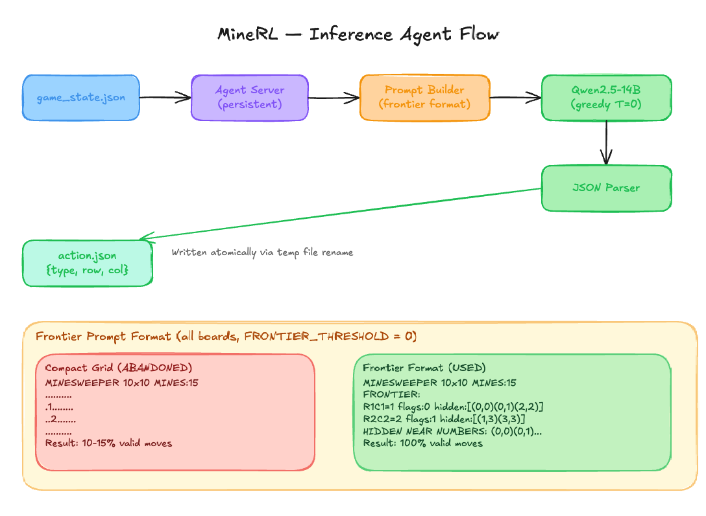
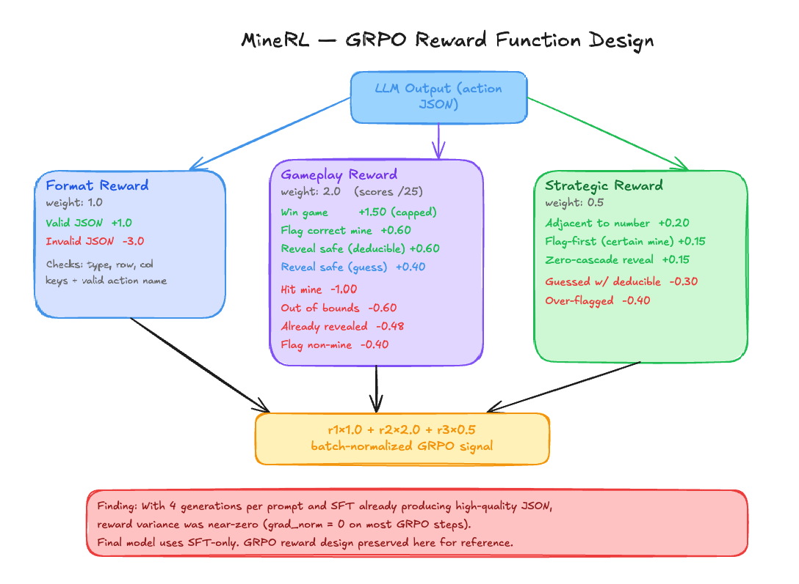

# SweeperLLM


> Teaching a large language model to play Minesweeper using constraint satisfaction and reinforcement learning.

SweeperLLM fine-tunes **Qwen2.5-14B-Instruct** to play Minesweeper by combining a hand-built 3-tier constraint solver for training data generation with supervised fine-tuning (SFT) and an explored GRPO reinforcement learning stage.

The key insight that made this work: instead of asking the model to read a spatial ASCII grid, we represent the board as an explicit **frontier constraint list** — and the model went from 10–15% valid moves to **100% valid moves** on all board sizes.

### Why this is hard

Minesweeper looks trivial for a language model — it's just logic on a grid. But LLMs trained on text have no native ability to parse 2D spatial layouts. A model reading a 30×30 ASCII board must locate each cell, count its neighbors, and maintain a constraint graph entirely in attention — something it was never trained to do. The real challenge isn't teaching the model Minesweeper rules (those fit in a prompt), it's finding a representation that maps the board state to something the model can already reason about. Once we reframed the board as an explicit list of constraints with coordinate references, the valid move rate jumped 10× without changing the model or training at all.

---

## Results

| Board | Games | Valid Move Rate | Avg Score |
|-------|-------|----------------|-----------|
| 6×6   | 20    | 100%           | +11.2     |
| 8×8   | 20    | 100%           | +25.2     |
| 10×10 | 20    | 100%           | +43.0     |
| 16×16 | 10    | 100%           | +35.5     |
| 20×20 | 10    | 100%           | +87.0     |
| 30×30 | 5     | 100%           | +9.0      |
| **Total** | **85** | **100%** | **+33.6** |

---

## Architecture

### Overview

```
Solver (3-tier CSP)
      |
      v
Data Generator (50K examples, multiprocessing)
      |
      v
SFT Training (Qwen2.5-14B + LoRA r=64)
      |
      v
Fine-tuned Model
      |
      v
Agent Server (persistent, watches game_state.json)
      |
      v
action.json → Controller
```

### Training Pipeline


### Solver Architecture


### Agent Flow


### GRPO Reward Design


---

### 3-Tier Constraint Satisfaction Solver (`solver.py`)

The solver generates all training labels and computes per-cell mine probabilities. It runs three escalating tiers until it resolves what it can:

**Tier 1 — Single Cell Propagation** (~60–70% coverage)

For each revealed number `N` with adjacent flags `F` and hidden cells `U`:
- `N == F` → all cells in `U` are safe → reveal
- `N - F == |U|` → all cells in `U` are mines → flag

Iterated to a fixed point.

**Tier 2 — Coupled Constraint Subset Reduction** (~85–90% coverage)

Builds a constraint set from all revealed numbers. For any pair where constraint A's cell set is a strict subset of B's, subtracts A from B to create a new, tighter constraint. New deductions are fed back into Tier 1.

**Tier 3 — Tank Solver / Backtracking Enumeration**

Identifies the *frontier* (unrevealed cells adjacent to numbered cells) and partitions it into connected components via Union-Find. Enumerates all valid mine configurations per component via backtracking, weighted by `C(Y, M–m)` using `lgamma` to avoid overflow on large interiors. Outputs a mine probability per frontier cell. Components over 35 cells or exceeding a 1-second timeout fall back to Tier 2 results.

---

## Ablations

### Prompt Format vs Valid Move Rate

| Format | Description | Valid Move Rate |
|--------|-------------|----------------|
| Compact ASCII grid | 2D character grid, model reads spatially | ~10–15% |
| **Frontier constraint list** | Explicit coordinate lists per number cell | **100%** |

### SFT vs SFT + GRPO

| Training | Valid Move Rate | Avg Score | Notes |
|----------|----------------|-----------|-------|
| SFT only | **100%** | **+33.6** | Selected model |
| SFT + GRPO | 100% | Degraded | grad_norm ≈ 0, no learning signal |

Root cause: with 4 rollouts per prompt and an already strong SFT model, nearly all generations were valid moves — leaving near-zero reward variance for GRPO to estimate advantage from. This is a known GRPO failure mode.

---

### Frontier Prompt Format

**Compact grid format** (baseline):
```
MINESWEEPER 10x10 MINES:15 FLAGS:2 LEFT:13
..........
.1........
```
Result: **10–15% valid moves**

**Frontier format** (ours):
```
MINESWEEPER 10x10 MINES:15 FLAGS:2 LEFT:13
FRONTIER (numbered cells with hidden neighbors):
R1C1=1 flags:0 hidden:[(0,0)(0,1)(0,2)(2,0)(2,2)]
R2C1=1 flags:1 hidden:[(3,0)(3,1)(3,2)]
HIDDEN NEAR NUMBERS: (0,0)(0,1)(0,2)...
TOTAL HIDDEN: 72  INTERIOR(no adj number): 54
Output ONLY: {"type":"reveal"|"flag","row":R,"col":C}
```
Result: **100% valid moves** on all board sizes.

---

## Project Structure

```
SweeperLLM/
├── solver.py                  # 3-tier CSP solver with probability computation
├── generate_data.py           # Parallel training data generator (50K examples)
├── minesweeper_train.py       # Full SFT + GRPO training pipeline
├── run_grpo.py                # Standalone GRPO training script
├── run_grpo_frontier.py       # GRPO variant with frontier constraint evaluation
├── minesweeper_config.yaml    # Inference configuration
├── merge_model.py             # Merge LoRA adapter into base model
├── eval_final.py              # Full evaluation across board sizes
├── eval_compare.py            # SFT vs GRPO comparison
├── prompt_battle.py           # Compare prompting strategies head-to-head
├── test_e2e.py                # End-to-end test via agent code path
├── agents/
│   ├── minesweeper_agent.py   # Prompt builder + action parser
│   ├── minesweeper_model.py   # Model loader + greedy inference
│   └── agent_server.py        # Persistent server (watches inputs/, writes outputs/)
├── docs/                      # Architecture diagrams
└── requirements.txt
```

---

## Quick Start

```bash
pip install -r requirements.txt

# Generate training data
python generate_data.py --target 50000 --workers 32 --output minesweeper_training_data.jsonl

# Train
python minesweeper_train.py

# Evaluate
python eval_final.py

# Run agent server
python -m agents.agent_server --config minesweeper_config.yaml
```

---

## Key Findings

**Frontier format is everything.** Reformatting board state from a 2D grid to an explicit constraint list was the single biggest improvement — 10× better valid move rate before any fine-tuning changes.

**SFT outperforms SFT+GRPO here.** With an already capable base model and only 4 generations per GRPO prompt, reward variance was near-zero. GRPO worked as designed but had nothing to learn from. This is a known failure mode: GRPO needs diverse rollouts to estimate advantage.

**lgamma over math.comb.** The Tank solver originally used `math.comb()` for binomial weighting, which overflows on large board interiors. Switching to log-space via `lgamma` fixed this.

**1 epoch SFT prevents overfitting.** With 50K structured examples, more than 1 epoch causes the model to memorise rather than generalise to unseen board configurations.

---

## Citation

```bibtex
@article{shaikh2026sweeper,
  title={Representation Over Training: How Board State Formatting Determines LLM Game-Playing Validity in Minesweeper},
  author={Shaikh, Farseen},
  journal={arXiv preprint},
  year={2026}
}
```

---

## License

MIT
